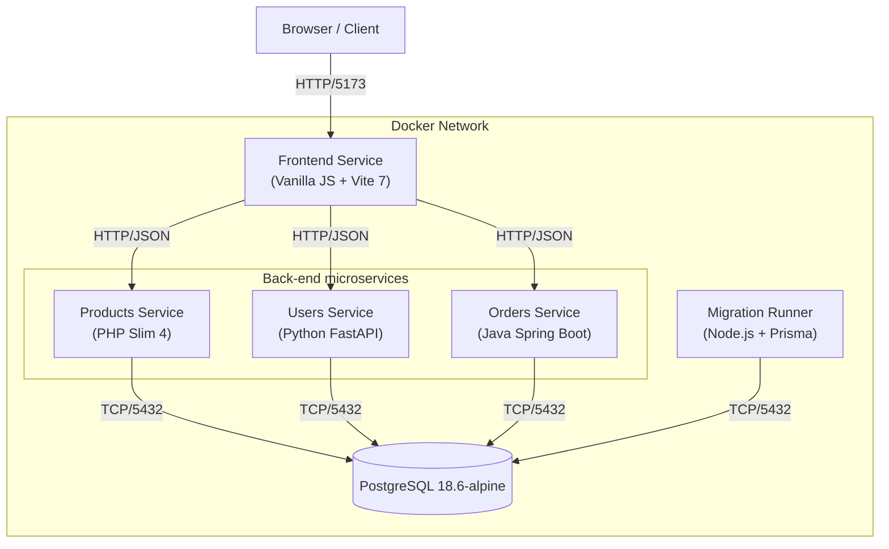

# E-commerce Starter Project Architecture

The E-commerce Starter Project is a microservices-based web application designed for university students to learn end-to-end application development.

## System Overview
The system consists of a Single Page Application (SPA) frontend, three backend services, and a migration runner, all orchestrated via Docker Compose.

### Architecture Diagram

### Components

1.  **Frontend**
    -   **Tech Stack**: Vanilla JavaScript, Vite 7.3.6 (Node.js 24-alpine environment).
    -   **Role**: User interface for browsing products and managing user accounts.
    -   **Communication**: Consumes HTTP/1.1 JSON REST APIs exposed by the backend services.
    -   **Port**: Exposed on host port (variable) (internal `5173`).

2.  **Products Service**
    -   **Tech Stack**: PHP 8.4 (Apache), Slim 4.15.3.
    -   **Role**: Manages product catalog (CRUD operations).
    -   **Port**: Exposed on host port `8082` (internal `80`).

3.  **Users Service**
    -   **Tech Stack**: Python 3.13 (Slim), FastAPI 0.141.1.
    -   **Role**: Handles user registration and authentication.
    -   **Port**: Exposed on host port `8000` (internal `8000`).

4.  **Orders Service**
    -   **Tech Stack**: Java 25 (LTS), Spring Boot 4.1.1.
    -   **Role**: Manages customer orders.
    -   **Port**: Exposed on host port `8083` (internal `8080`).

5.  **Database**
    -   **Tech Stack**: PostgreSQL 18.6-alpine.
    -   **Role**: Shared persistent storage for both services (Database: `ecommerce_db`).

6.  **Migration Runner**
    -   **Tech Stack**: Node.js 24-slim, Prisma 7.10.0.
    -   **Role**: Handles database migrations and data seeding.

## Infrastructure
-   **Containerization**: All components are containerized using Docker.
-   **Orchestration**: `docker-compose.yml` manages the service lifecycle and creates a default bridge network.
-   **Configuration**: Environment variables (ports, credentials) are centralized in a `.env` file.
-   **Version pinning**: Every base image and dependency is pinned to an exact
    version so that a clone built today and a clone built next semester produce
    the same stack. The trade-off is that upgrades are deliberate: the pins need
    a review roughly once per semester.
-   **Persistence**: The PostgreSQL volume is mounted at `/var/lib/postgresql`,
    which is where the 18+ images expect it (they store data under a
    major-version subdirectory such as `18/docker`).
