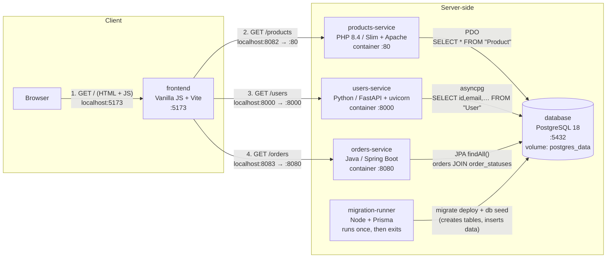

# Module 1 — System map

## a. My own diagram

## b. One request, traced end to end

Request traced: **`GET /users`**, the users list rendered on page load.

| Hop (from `module-01.md`)                                                                    | `file:line`                                                                                                                                                                                                                                                                                                                                                                                                                                                                                                                                                                        |
| -------------------------------------------------------------------------------------------- | ---------------------------------------------------------------------------------------------------------------------------------------------------------------------------------------------------------------------------------------------------------------------------------------------------------------------------------------------------------------------------------------------------------------------------------------------------------------------------------------------------------------------------------------------------------------------------------- |
| Frontend file and line that issues the request                                               | [`frontend/src/main.js:62`](../../frontend/src/main.js#L62) (`DOMContentLoaded` listener) [`frontend/src/main.js:56`](../../frontend/src/main.js#L56) (`renderUsers(...)`) [`frontend/src/components/users.js:11`](../../frontend/src/components/users.js#L11) (`` fetchData(`${apiUrl}/users`) ``) [`frontend/src/api/api.js:8`](../../frontend/src/api/api.js#L8) (`fetch(url)`)                                                                                                                                                                                     |
| The URL and the service that receives it — `http://localhost:8000/users` → **users-service** | [`frontend/src/main.js:8`](../../frontend/src/main.js#L8) (base URL) [`docker-compose.yml:19`](../../docker-compose.yml#L19) (`VITE_USERS_API_URL`) [`.env:4`](../../.env#L4) (`USERS_SERVICE_PORT=8000`) [`docker-compose.yml:52`](../../docker-compose.yml#L52) (port mapping)                                                                                                                                                                                                                                                                                   |
| The route or controller that matches it                                                      | [`users-service/main.py:35-36`](../../users-service/main.py#L35-L36) (`@app.get("/users")` → `get_users()`) [`users-service/main.py:13-19`](../../users-service/main.py#L13-L19) (CORS)                                                                                                                                                                                                                                                                                                                                                                                        |
| The query or ORM call that runs, and the table it touches — raw SQL on **`"User"`**          | [`users-service/main.py:26-33`](../../users-service/main.py#L26-L33) (`get_db_connection`) [`users-service/main.py:23`](../../users-service/main.py#L23) (`USER_COLUMNS`, no `password`) [`users-service/main.py:39`](../../users-service/main.py#L39) (`conn.fetch(...)`) [`database/prisma/migrations/20251125234441_init/migration.sql:2`](../../database/prisma/migrations/20251125234441_init/migration.sql#L2) (`CREATE TABLE "User"`) [`database/prisma/schema.prisma:14`](../../database/prisma/schema.prisma#L14) (`model User`, source of the migration) |
| The frontend function that turns the response into DOM — `renderUsers()`                     | [`frontend/src/api/api.js:12`](../../frontend/src/api/api.js#L12) (`response.json()`) [`frontend/src/components/users.js:18-29`](../../frontend/src/components/users.js#L18-L29) (render cards) [`frontend/src/components/users.js:41-45`](../../frontend/src/components/users.js#L41-L45) (`escapeHtml`) [`frontend/src/components/users.js:30-33`](../../frontend/src/components/users.js#L30-L33) (error path)                                                                                                                                                      |

## c. Environment gotchas

The only problem i faced is port-forwarding
## d. One thing the documentation gets wrong or leaves out

_TODO_
