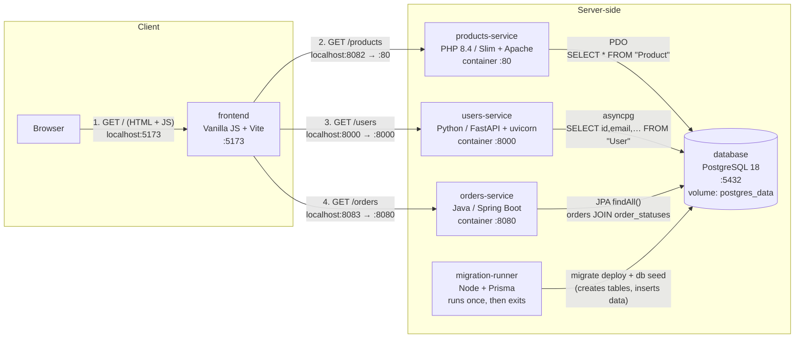

# Module 1 — System map

## a. Diagram

## b. One request, traced end to end

Request traced: **`GET /users`**, the users list rendered on page load.

| Hop (from `module-01.md`)                                                                    | `file:line`                                                                                                                                                                                                                                                                                                                                                                                                                                                                                                                                                                        |
| -------------------------------------------------------------------------------------------- | ---------------------------------------------------------------------------------------------------------------------------------------------------------------------------------------------------------------------------------------------------------------------------------------------------------------------------------------------------------------------------------------------------------------------------------------------------------------------------------------------------------------------------------------------------------------------------------- |
| Frontend file and line that issues the request                                               | [`frontend/src/main.js:62`](../../frontend/src/main.js#L62) (`DOMContentLoaded` listener) [`frontend/src/main.js:56`](../../frontend/src/main.js#L56) (`renderUsers(...)`) [`frontend/src/components/users.js:11`](../../frontend/src/components/users.js#L11) (`` fetchData(`${apiUrl}/users`) ``) [`frontend/src/api/api.js:8`](../../frontend/src/api/api.js#L8) (`fetch(url)`)                                                                                                                                                                                     |
| The URL and the service that receives it — `http://localhost:8000/users` → **users-service** | [`frontend/src/main.js:8`](../../frontend/src/main.js#L8) (base URL) [`docker-compose.yml:19`](../../docker-compose.yml#L19) (`VITE_USERS_API_URL`) [`.env:4`](../../.env#L4) (`USERS_SERVICE_PORT=8000`) [`docker-compose.yml:52`](../../docker-compose.yml#L52) (port mapping)                                                                                                                                                                                                                                                                                   |
| The route or controller that matches it                                                      | [`users-service/main.py:35-36`](../../users-service/main.py#L35-L36) (`@app.get("/users")` → `get_users()`) [`users-service/main.py:13-19`](../../users-service/main.py#L13-L19) (CORS)                                                                                                                                                                                                                                                                                                                                                                                        |
| The query or ORM call that runs, and the table it touches — raw SQL on **`"User"`**          | [`users-service/main.py:26-33`](../../users-service/main.py#L26-L33) (`get_db_connection`) [`users-service/main.py:23`](../../users-service/main.py#L23) (`USER_COLUMNS`, no `password`) [`users-service/main.py:39`](../../users-service/main.py#L39) (`conn.fetch(...)`) [`database/prisma/migrations/20251125234441_init/migration.sql:2`](../../database/prisma/migrations/20251125234441_init/migration.sql#L2) (`CREATE TABLE "User"`) [`database/prisma/schema.prisma:14`](../../database/prisma/schema.prisma#L14) (`model User`, source of the migration) |
| The frontend function that turns the response into DOM — `renderUsers()`                     | [`frontend/src/api/api.js:12`](../../frontend/src/api/api.js#L12) (`response.json()`) [`frontend/src/components/users.js:18-29`](../../frontend/src/components/users.js#L18-L29) (render cards) [`frontend/src/components/users.js:41-45`](../../frontend/src/components/users.js#L41-L45) (`escapeHtml`) [`frontend/src/components/users.js:30-33`](../../frontend/src/components/users.js#L30-L33) (error path)                                                                                                                                                      |

## c. Environment gotchas

During set up no major problems were faced. Only the overall structure appeared cumbersome due to multiple technologies. First build took somewhat around 7 minutes.

## d. One thing the documentation gets wrong or leaves out

### The Database entry leaves out its port

Every service component in `ARCHITECTURE.md` has a **Port** line, but the Database entry at [`ARCHITECTURE.md:60-62`](../../ARCHITECTURE.md#L60-L62) does not.

- **Database:** it *is* published. [`docker-compose.yml:84`](../../docker-compose.yml#L84) maps `"${DB_PORT}:5432"`, and [`.env.example:6`](../../.env.example#L6) sets `DB_PORT=5432`, so it is exposed on host port `5432` (internal `5432`). Services inside the network reach it as `database:5432`.

### Changing ports: barely documented, and the one example breaks the frontend

**Where changing ports is (and is not) documented**

| File                                                       | What it says                                                                                                                                   |
| ---------------------------------------------------------- | ---------------------------------------------------------------------------------------------------------------------------------------------- |
| [`README.md:4-8`](../../README.md#L4-L8)                   | Fixed ports only ("Port 8082" etc.). Never says they can be changed.                                                                           |
| [`ARCHITECTURE.md:71`](../../ARCHITECTURE.md#L71)          | "Environment variables (ports, credentials) are centralized in a `.env` file". Implies it, never says how.                                     |
| [`ARCHITECTURE.md:43-58`](../../ARCHITECTURE.md#L43-L58)   | Only the frontend is "host port (variable)". Products, Users and Orders are listed with fixed host ports, although all three come from `.env`. |
| [`dev-starter.md:124-141`](../../dev-starter.md#L124-L141) | The **only** instructions: "modify the ports in `.env`", with an example.                                                                      |

### Changing the frontend port also needs `vite.config.js`, which no doc mentions

[`dev-starter.md:133-137`](../../dev-starter.md#L133-L137) says to "modify the ports in `.env`" and gives `FRONTEND_PORT=3000` as an example. For the frontend, `.env` alone is not enough:

- [`docker-compose.yml:13`](../../docker-compose.yml#L13) maps `"${FRONTEND_PORT}:${FRONTEND_PORT}"`, so with `3000` the mapping becomes `3000:3000`.
- Vite still listens on `5173`, hard-coded in [`frontend/vite.config.js:6`](../../frontend/vite.config.js#L6) (`port: 5173`).
- Nothing listens on port 3000 inside the container, so `localhost:3000` does not load.

It only works today because the default `FRONTEND_PORT=5173` ([`.env.example:2`](../../.env.example#L2)) happens to match `vite.config.js`. To use another port, `port` in `vite.config.js` has to be changed to the same value, and no document says so.

### Minor innacuracies
ARCHITECTURE.md:62 calls the database "Shared persistent storage for both services", but three services use it.
